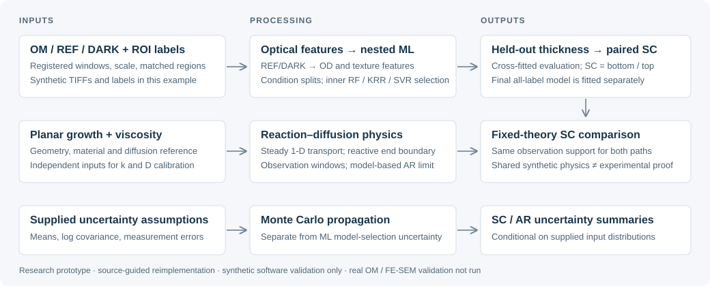
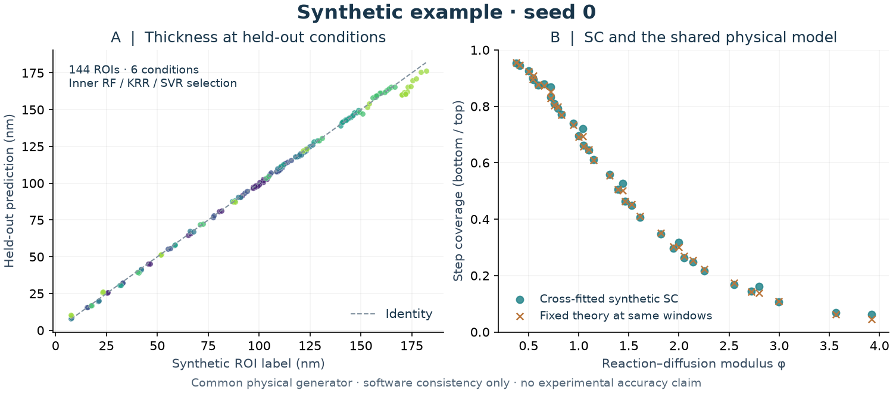

# cvd-reconstruction · 0.2.2

**Connect trench-coating physics, microscope-image features and condition-level ML to estimate thickness and step coverage.**


A research prototype reimplemented from supplied research descriptions and specifications. The runnable study uses **synthetic images, labels and calibration inputs**. It is not recovered laboratory code or a reproduction of measured experimental performance. Real OM / FE-SEM validation has not been run.

[Quickstart](#quickstart) · [Example results](#example-results) · [Model](docs/MODEL.md) · [Input contracts](docs/INPUT_CONTRACTS.md) · [Validation](docs/VALIDATION.md) · [한국어](README.ko.md)



## Overview

How does coating thickness change along a rectangular trench, and how much reaches the bottom relative to the top? This repository connects steady reaction–diffusion physics to registered optical measurements and thickness labels, then evaluates RF, KRR and SVR at **held-out conditions**.

The deliverable is an inspectable Python workflow: generated inputs, metrology checks, ROI features, evaluation records, paired step coverage (SC), theory comparisons and uncertainty summaries. A final model is fitted separately using all labels; its training predictions are not independent evaluation. The demonstrated calibration is entirely synthetic.

## Pipeline

| Stage | Actual implementation | Code |
|---|---|---|
| Physical calibration | Planar growth and viscosity supply reaction/diffusion parameters; geometry and material rates define steady 1-D transport | [calibration](cvd_cbd/calibration.py), [physics](cvd_cbd/physics.py) |
| Image metrology | Registered TIFFs, REF/DARK correction, `T=(I−DARK)/(REF−DARK)`, OD, scale and observation-window checks; separate texture features | [metrology](cvd_cbd/metrology.py), [dataset](cvd_cbd/dataset.py) |
| Thickness evaluation | Outer condition LOGO; inner grouped RF/KRR/SVR and hyperparameter selection; fold-local X/y scaling | [modeling](cvd_cbd/modeling.py) |
| Thickness → SC | Pair bottom/top regions, propagate available measurement errors, compare predicted or label-derived SC with fixed theory at matched windows | [inference](cvd_cbd/infer.py), [similitude](cvd_cbd/similitude.py) |
| Uncertainty | Separately propagate supplied means/log covariance and measurement assumptions to SC and model-dependent AR limits | [uncertainty](cvd_cbd/uncertainty.py) |

ROIs are labeled observations; tiles are features, not extra independent samples. Shared batch, specimen, image or content dependencies crossing conditions are rejected. Monte Carlo intervals are conditional on supplied assumptions, not calibrated ML prediction intervals. [Model assumptions and boundaries](docs/MODEL.md).

## Quickstart

Recorded environment: **Windows 11 / CPython 3.12.14**, with the included runtime/build pins. Python ≥3.10 is the package declaration, not a tested support matrix for these locks. Private cloning requires authorized GitHub access.

```sh
git clone https://github.com/mthogeon0731/cvd-reconstruction.git
cd cvd-reconstruction
python -m venv .venv
```

| Shell | Activate |
|---|---|
| Windows PowerShell | `.\.venv\Scripts\Activate.ps1` |
| macOS / Linux syntax — not a tested platform claim | `source .venv/bin/activate` |

```sh
python -m pip install -r requirements-build-lock.txt
python -m pip install -r requirements-lock.txt
python -m pip install --no-build-isolation --no-deps .
python -m pip check
python examples/minimal.py
```

The minimal example has no file inputs and prints synthetic endpoint concentration ratio `SC ≈ 0.87327137`. It does not train ML or validate real coatings.

Run the complete study and regenerate the README figure:

```sh
python -m cvd_cbd study demo --config configs/synthetic_study.json --out outputs/portfolio_demo
python verification/verify_run.py --run outputs/portfolio_demo --out outputs/portfolio_demo_verification.json
python scripts/render_example.py --run outputs/portfolio_demo --out docs/assets
```

Use a **new output directory** each time. The study generates its own inputs; no archive or external fixture is needed. `cvd-study` is the installed equivalent of `python -m cvd_cbd study`. The older `python demo.py` runs a separate uncalibrated surrogate. For separate generation and individual stages, see [the 14-command CLI procedure](docs/CLI.md).

## Example Results



*Synthetic example, seed 0. Panel A colors distinguish six conditions; every point is an outer-fold prediction. Panel B compares condition/AR-averaged SC from those predictions with fixed theory at the actual observation windows. No research photographs or experimental observations are used.*

| Quantity from the newly generated example | Result | Interpretation |
|---|---:|---|
| Labeled trench ROIs / conditions | 144 / 6 | Synthetic observations, not tile count |
| Nested thickness R² / RMSE | 0.996754 / 2.657990 nm | Held-out synthetic label prediction |
| Cross-fitted SC vs fixed theory R² | 0.998786 | 36 condition/AR points from predicted thickness |
| Synthetic label SC vs fixed theory R² | 0.999887 | FE-SEM stand-in labels; no real FE-SEM |

The generator uses `OD = thickness_nm / 450`, artificial camera/label noise and the same physics used in the comparison. High scores test **software consistency with a common generator**, not experimental accuracy or independent physical validity. The historical ≈0.9967 and ≈0.99989 carry the same limitation. [Figure inputs, settings and exact metrics](docs/EXAMPLE.md).

## Data & Outputs

Inputs come from [synthetic.py](cvd_cbd/synthetic.py) and [synthetic_study.json](configs/synthetic_study.json). Real data are not distributed. CSVs in [templates](templates) contain headers only; [input contracts](docs/INPUT_CONTRACTS.md) explain the evidence required. The real-study configuration has unverified placeholders and is not a runnable real-data example.

Paths below are relative to `outputs/portfolio_demo/`:

| Path | Contents |
|---|---|
| `SYNTHETIC_inputs/` | Generated TIFFs, labels, property tables and artificial calibration evidence |
| `SYNTHETIC_results/features/` | Registered ROI features and image QC |
| `SYNTHETIC_results/evaluation/` | Splits, inner candidates, selected held-out predictions and metrics |
| `SYNTHETIC_results/final_model/` | Separately fitted all-label inference model |
| `SYNTHETIC_results/similitude_cross_fitted/` | Predicted SC vs fixed theory at matched windows |
| `SYNTHETIC_results/similitude_fesem/` | Synthetic label-derived SC vs fixed theory |
| `SYNTHETIC_results/process_window/` | Model-dependent aspect-ratio limits |
| `SYNTHETIC_results/uncertainty_report.json` | Conditional Monte Carlo summaries |

Large outputs and model binaries stay out of Git; only the small representative figure and sanitized summary are tracked. Runtime provenance can include local paths: inspect outputs before sharing. Load only trusted models because joblib deserialization can execute code.

## Evaluation

```sh
python -m pytest tests -q
python scripts/check_repository.py
```

The clone-contained product suite has **360 tests**, including 49 strict-JSON regressions, and generates temporary data itself. Current executions and commands are in [validation](docs/VALIDATION.md). Figure checks are separate from this count.

Historical **505** = 360 product + 145 adapted audit cases; **89** independent checks are a separate historical suite. The untouched original audit remains **144 PASS / 1 mutation compatibility FAIL**. The historical README **14-stage execution** and separate **14-case smoke check** are distinct procedures. These counts are not added to the current product result. [Original failure, scope and external replay requirements](docs/EXTERNAL_AUDITS.md).

## Reproducibility

Seed **0**, the committed configuration and pinned dependencies define the example. [Reproduction instructions](docs/REPRODUCIBILITY.md) list input locations, source files, commands and environment controls. [The figure summary](docs/assets/synthetic-summary.json) records settings, source hashes and metrics without private paths.

Same-environment byte identity and cross-platform numerical agreement are different checks. Historical equality and older Windows/Linux discrepancies remain historical evidence. This refresh claims no Linux, macOS, other Python-version or GitHub Actions pass.

## Limitations

- **No real OM / FE-SEM validation.** Optical transfer, scale evidence, paired labels, acquisition independence and property calibration need experimental work.
- **Restricted physics.** Steady, dilute 1-D transport, constant diffusion and first-order surface reaction; no evolving geometry, flow, transient nucleation or demonstrated gas/liquid deposition equivalence.
- **Conditional uncertainty.** Supplied distributions and fixed-prediction condition bootstrap omit full model-selection uncertainty and unknown systematic errors.
- **Synthetic extrapolation.** The two-hour image example extrapolates a 10–40 minute planar-growth series; real time stability is unverified.
- **Model-based AR limits.** Threshold results under chosen assumptions, not manufacturing guarantees or universal critical aspect ratios.

## Repository Structure

```text
cvd_cbd/        physics, metrology, ML and study CLI
configs/        synthetic study and unverified real-data template
templates/      empty schemas and uncertainty template
examples/       minimal deterministic physics example
scripts/        figure rendering and repository/CLI checks
tests/          self-contained product tests
verification/   output and run-comparison checks
docs/           model, contracts, validation, rights and small figures
```

## References

- [Model equations, observables and assumptions](docs/MODEL.md), with implementation links in [Pipeline](#pipeline).
- [scikit-learn grouped cross-validation](https://scikit-learn.org/stable/modules/cross_validation.html#cross-validation-iterators-for-grouped-data), for the evaluation API used here.
- [Source provenance](docs/PROVENANCE.md): supplied descriptions/specifications informed this reimplementation. Original laboratory source and an independently verified publication bibliography are not supplied; historical research performance is not claimed.

For research reuse, please reference this repository and the exact commit/configuration. This is a voluntary reproducibility request, not an additional license condition.

## License

[MIT](LICENSE) · Copyright (c) 2026 Hogeon Kim. Covers the owner's code, tests, documentation and generated example assets. Dependencies retain their own licenses; see [rights and scope](docs/RIGHTS.md) and [dependency notices](docs/DEPENDENCIES.md).

License approval does not authorize changing visibility. This review stays private until the owner separately approves the final commit for publication.
